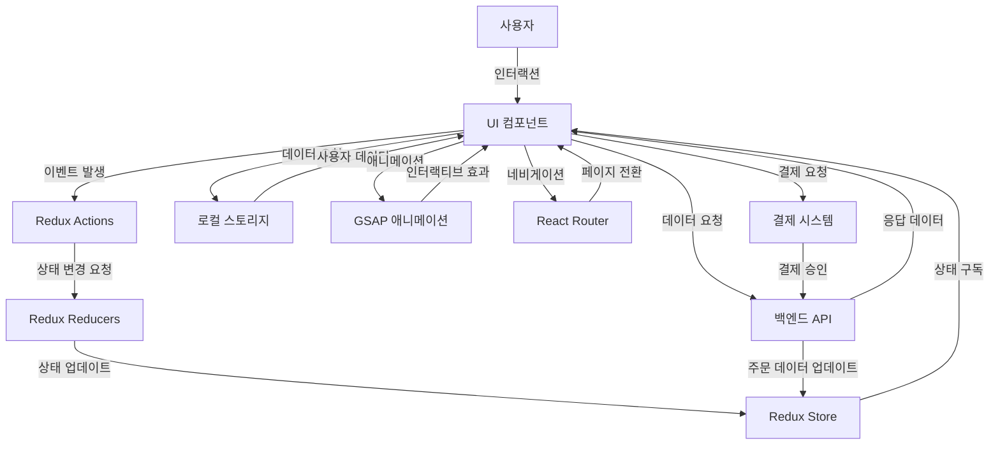

# 📋 Van Cleef 홈페이지 리뉴얼

[](LICENSE)
[](https://github.com/username/repository/stargazers)


## 📝 프로젝트 소개

본 프로젝트는 세계적인 럭셔리 주얼리 브랜드 반클리프 아펠의 웹사이트를 리뉴얼하는 것을 목표로 합니다.
다양한 동적 요소와 세련된 디자인을 도입하여 제품의 아름다움을 극대화하고 사용자 경험을 향상하는 것을 목표로 합니다.

##✨ 주요 기능

**🗂 상태 관리 및 사용자 관리**

Redux Toolkit을 활용한 상태관리: 효율적인 상태 관리 시스템으로 애플리케이션 데이터 흐름을 중앙화하여 관리합니다.

로컬스토리지를 활용한 사용자 관리: 로컬스토리지 기반의 로그인, 회원가입, 마이페이지 기능을 통해 사용자 경험을 향상시킵니다.

**🎨 UI/UX 및 애니메이션**

인터렉티브(GSAP): GSAP 라이브러리를 활용한 부드럽고 역동적인 인터페이스 애니메이션으로 사용자 상호작용을 향상시킵니다.

반응형 디자인: 모바일, 태블릿, 데스크톱에서 최적화된 UI 제공

다크 모드 지원: 사용자 환경에 따라 다크/라이트 모드 설정 가능

**🛍 제품 탐색 및 쇼핑 기능**

고급 필터 & 검색 기능: 가격, 컬렉션, 인기순 정렬 등 다양한 필터링 옵션 제공

위시리스트 & 장바구니 연동: 찜한 제품을 쉽게 관리하고 주문까지 원활하게 진행

3D 모델 뷰어: 주얼리 제품을 360도 회전하여 디테일하게 확인 가능

**🔗 소셜 & 개인화 요소**

소셜 로그인 지원: Google, Apple, Kakao 로그인 기능 제공

개인 맞춤 추천 시스템: 사용자의 구매/검색 히스토리를 기반으로 제품 추천

**💳 결제 및 주문 관리**

다양한 결제 옵션 지원: 신용카드, 간편결제, 해외결제 등 다양한 결제 방법 제공

실시간 주문 상태 확인: 결제 완료 → 배송 중 → 배송 완료 등 실시간 트래킹 기능


## 🛠️ 기술 스택

### 디자인


### 프론트엔드


### 배포


### 협업 도구


## 📋 시스템 아키텍처



## 🚀 설치 및 실행 방법

```bash
# 저장소 클론
git clone https://github.com/username/repository.git

# 디렉토리 이동
cd repository

# 의존성 설치
npm install
yarn install

# 개발 서버 실행
npm run dev
yarn dev

# 프로덕션 빌드
npm run build
yarn build

# 프로덕션 서버 실행
npm run start
yarn dev
```

## 🔧 환경 설정

```
# .env 파일
VITE_TMDB_API_KEY=your_api_key
```

## 📊 프로젝트 구조

```
src
├─assets
│  └─api
├─components
│  ├─authentication
│  ├─button
│  ├─checkbox
│  ├─dropdown
│  ├─input
│  ├─layout
│  ├─mypage
│  ├─pagination
│  ├─product
│  ├─productdetailc
│  ├─purchase
│  ├─reservationc
│  ├─ScrollToTop
│  └─size
├─pages
│  ├─about
│  │  └─components
│  ├─customercenter
│  │  └─components
│  ├─home
│  │  └─components
│  │      └─Section1
│  ├─kbrand
│  │  └─components
│  ├─login
│  ├─mypage
│  │  ├─cart
│  │  ├─logout
│  │  ├─myposts
│  │  ├─order
│  │  ├─profile
│  │  ├─recent
│  │  └─wishtlist
│  ├─notfile
│  ├─productdetail
│  ├─productinquiry
│  ├─ProductList
│  ├─purchase
│  ├─reservation
│  ├─search
│  │  └─componetns
│  └─signup
├─store
│  └─modules
└─styles
```

## 👨‍💻 팀원 소개

| 이름   | 역할                    | GitHub                                  | 이메일                        |
| ------ | ----------------------- | --------------------------------------- | ----------------------------- |
| 김미선 | 총괄/메인페이지          | [GitHub](https://github.com/msun97)      | https://github.com/msun97    |
| 권윤구 | 제품페이지/예약페이지   | [GitHub](https://github.com/peaceRyun)     | https://github.com/peaceRyun     |
| 안예지 | 제품리스트/제품페이지   | [GitHub](https://github.com/to-flatwhite1) | https://github.com/to-flatwhite1 |
| 권병윤 | 마이페이지/auth        | [GitHub](https://github.com/bybykwon)     | https://github.com/bybykwon    |

## 📈 프로젝트 진행 상황

- [x] 요구사항 분석
- [x] 디자인 및 UI/UX 설계
- [x] 데이터베이스 스키마 설계
- [x] API 구조 파악
- [x] 프론트엔드 개발
- [x] 테스트 및 QA
- [x] 배포


## 📞 연락처

프로젝트에 관한 문의나 제안이 있으시면 [이메일](mailto:miseong827@gmail.com)로 연락주세요.

---

⭐ 이 프로젝트가 마음에 드셨다면 GitHub Star를 눌러주세요! ⭐
